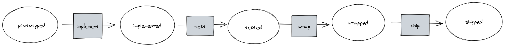

# Symfony Workflow tutorial

https://codereviewvideos.com/course/symfony-workflow-component-tutorial/video/a-simple-state-machine-example

## Steps

## Make entity and controller

- `composer require symfony/maker-bundle --dev`
- `php bin/console make:entity`
- Product with name as string
- `php bin/console make:controller`
- ProductController

## Setup database

- `php bin/console doctrine:database:create`
- `php bin/console doctrine:schema:create`

## Add a Statemachine

## Print the Workflow

- `symfony console workflow:dump product | dot -Tpng -o workflow.png`

## Add view

- `composer require twig` generates the template sub folder and the base template

### Prepare the Product entity for the state machine

- add 'status' property to the Product entity `php bin/console make:entity`
- create a migration `php bin/console make:migration`
- run the migration `php bin/console doctrine:migrations:migrate`

## Sample data / load fixtures

- `composer require --dev orm-fixtures`
- `php bin/console doctrine:fixtures:load`